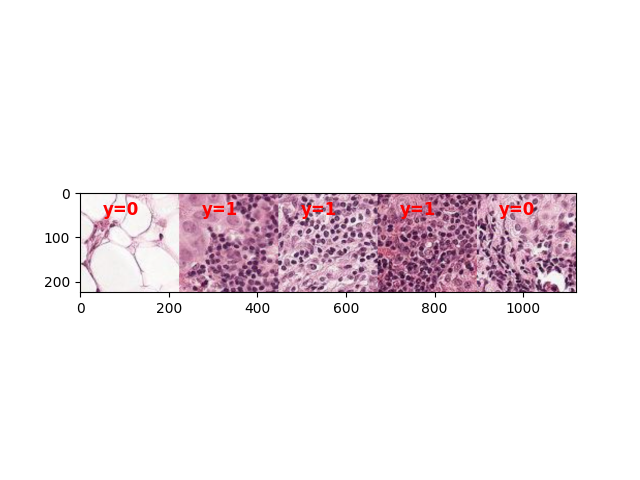

# ProjectMilestoneExample
This is an example of a Repository for the DSCI 410/510 Project Milestone

## Project Overview
This project is a simple example of a Repository for the DSCI 410/510 Project Milestone.This project uses the PCAM dataset of breast cancer images. The labels are either 0 or 1 which are assigned randomly. This project test the ability of Convolutional Neural Networks to memorize labels.

## Data Overview
The PCAM dataset is a collection of breast cancer images. The images are 96x96x3 numpy arrays. The labels are either 0 or 1 which are assigned randomly. An example notebook with data loaders is provided in notebooks/data_demo.ipynb

## Methods Overview
In progress

## Results
In progress

## Conclusion
In progress